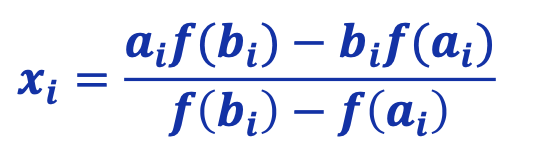
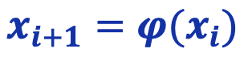
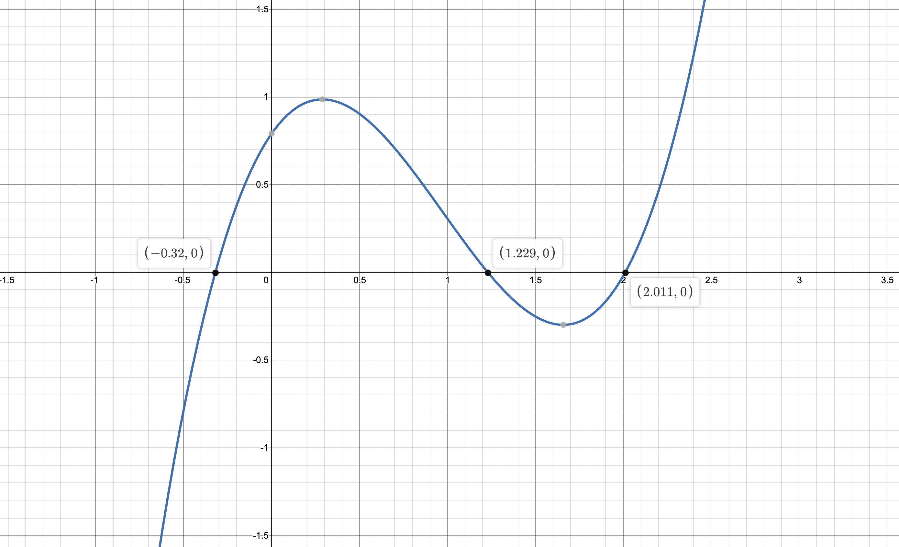

# Лабораторная №2 «Численное решение нелинейных уравнений и систем»
**Вариант № 19**

| Выполнил      | Группа | Преподаватель  |
|:--------------|--------|----------------|
| Яковлев Г. А. | P3213  | Малышева Т. А. |

## Цель работы
Изучить численные методы решения нелинейных уравнений и их систем,
найти корни заданного нелинейного уравнения, выполнить программную реализацию методов.

## Задания л/р
- Отделить корни заданного нелинейного уравнения графически **x<sup>3</sup> - 2,92x<sup>2</sup> + 1,435x + 0,791**
- Определить интервалы изоляции корней.
- Уточнить корни нелинейного уравнения с точностью  ε = 10<sup>-2</sup>. Вычисления оформить в виде таблиц, удержать 3 знака после запятой:
  - Крайний левый корень методом **половинного деления**.
  - Центральный корень методом **секущих**.
  - Крайний правый корень методом **простой итерации**.
- Реализовать методы в программе:
  - Метод **хорд**
  - Метод **простой итерации**
  - Решение систем нелинейных уравнений методом **простой итерации**

## Порядок выполнения л/р
1. Отделить корни заданного нелинейного уравнения графически.
2. Определить интервалы изоляции корней.
3. Уточнить корни линейного уравнения с помощью различных методов.
4. Реализовать методы в программе.

## Рабочие формулы используемых методов
Для метода хорд:



Для методов простой итерации:



## Таблицы



* Метод простой итерации:

|  i   | x<sub>k</sub> | f(x<sub>k</sub>) | x<sub>k+1</sub> | φ(x<sub>k</sub>) | \|x<sub>k</sub> - x<sub>k+1</sub>\| |
| :--: | :-----------: | :--------------: | :-------------: | :--------------: | :---------------------------------: |
|  0   |     3.000     |      5.816       |      2.467      |      2.169       |                0.533                |
|  1   |     2.467     |      1.575       |      2.169      |      2.041       |                0.298                |
|  2   |     2.169     |      0.371       |      2.041      |      2.012       |                0.129                |
|  3   |     2.041     |      0.057       |      2.012      |      2.011       |                0.029                |
|  4   |   **2.012**   |      0.003       |      2.011      |      2.011       |                0.001                |

<u>Правый крайний корень</u> получился — **2.012**

* Метод секущих:

|  i   | x<sub>k-1</sub> | f(x<sub>k-1</sub>) | x<sub>k</sub> | f(x<sub>k</sub>) | x<sub>k+1</sub> | f(x<sub>k+1</sub>) | \|x<sub>k</sub> - x<sub>k+1</sub>\| |
| :--: | :-------------: | :----------------: | :-----------: | :--------------: | :-------------: | :----------------: | :---------------------------------: |
|  0   |      1.500      |       -0.252       |     0.030     |      0.831       |      1.159      |       0.089        |                1.129                |
|  1   |      0.030      |       0.831        |     1.159     |      0.089       |      1.294      |       -0.075       |                0.136                |
|  2   |      1.159      |       0.089        |     1.294     |      -0.075      |      1.232      |       -0.003       |                0.062                |
|  3   |      1.294      |       -0.075       |     1.232     |      -0.003      |      1.229      |       0.000        |                0.003                |
|  4   |      1.232      |       -0.003       |   **1.229**   |      0.000       |      1.229      |       -0.000       |                0.000                |

*Центральный корень* получился — **1.229**

* Метод половинного деления:

|  i   |   a    |   b    |     x      |  f(a)  | f(b)  |  f(x)  | \|a - b\| |
| :--: | :----: | :----: | :--------: | :----: | :---: | :----: | :-------: |
|  0   | -1.000 | 0.000  |   -0.500   | -4.564 | 0.791 | -0.781 |   1.000   |
|  1   | -0.500 | 0.000  |   -0.250   | -0.781 | 0.791 | 0.234  |   0.500   |
|  2   | -0.500 | -0.250 |   -0.375   | -0.781 | 0.234 | -0.210 |   0.250   |
|  3   | -0.375 | -0.250 |   -0.312   | -0.210 | 0.027 | -0.088 |   0.062   |
|  4   | -0.375 | -0.312 |   -0.344   | -0.210 | 0.027 | -0.088 |   0.062   |
|  5   | -0.344 | -0.312 |   -0.328   | -0.088 | 0.027 | -0.030 |   0.031   |
|  6   | -0.328 | -0.312 |   -0.320   | -0.030 | 0.027 | -0.001 |   0.016   |
|  7   | -0.320 | -0.312 | **-0.316** | -0.001 | 0.027 | 0.013  |   0.008   |

*Крайний правый корень* получился — **-0.316**

## Листинг программы
Метод **хорд**:

```python
def chord_method(f: Callable, a: float, b: float, accuracy: float,
                 max_iterations: int = 100) -> Tuple:
    fields, rows = ['i', 'a', 'b', 'x', 'f(a)', 'f(b)', 'f(x)', '|a - b|'], []

    # Проверка на наличие корня
    if f(a) * f(b) >= 0:
        fatal_error(f"На концах отрезка [{a}, {b}] функция имеет одинаковые знаки.\n"
                    f"На отрезке либо нет корней, либо их четное количество. Пожалуйста, уточните интервал.")

    # Выбор начального приближения
    if f(a) * dd(f, a) > 0:
        x0 = a
    else:
        x0 = b

    i = 0
    while True:
        xi = (a * f(b) - b * f(a)) / (f(b) - f(a))
        rows.append([i, a, b, xi, f(a), f(b), f(xi), abs(a - b)])

        if (abs(xi - x0) < accuracy and abs(f(xi)) < accuracy) or i > max_iterations:
            return make_report(f, i, xi, abs(xi - x0)), make_table(fields, rows), show_graph(f, xi)

        if f(xi) * f(a) < 0:
            b = xi
        else:
            a = xi

        i += 1
        x0 = xi
```


Метод **простой итерации**:

```python
def simple_iteration_method(f: Callable, a: float, b: float, accuracy: float,
                            max_iterations: int = 100) -> Tuple:
    fields, rows = ['i', 'xi', 'f(xi)', 'xi+1', 'φ(xi)', '|xi - xi+1|'], []

    def phi(x: float) -> float:
        _lambda = -1 / max(d(f, a), d(f, b))
        return x + _lambda * f(x)

    def calculate_answer(func: Callable[[float], float], x0) -> Tuple:
        i = 0
        while True:
            xi = func(x0)
            rows.append([i, x0, f(x0), xi, func(xi), abs(xi - x0)])

            if abs(xi - x0) < accuracy or i > max_iterations:
                return make_report(f, i, xi, abs(f(xi))), make_table(fields, rows), show_graph(f, xi)

            i += 1
            x0 = xi

    if abs(d(phi, a)) < 1 and abs(d(phi, b)) < 1:
        # Выбор начального приближения
        if f(a) * dd(f, a) > 0:
            return calculate_answer(phi, a)
        else:
            return calculate_answer(phi, b)
    else:
        fatal_error("Интервал неверный, не выполняется достаточное условие сходимости метода.")
```

Решение систем нелинейных уравнений методом **простой итерации**:
```python
def system_simple_iteration_method(func1, a1: float, func2, a2: float, accuracy: float,
                                   max_iterations: int = 100) -> Tuple:
    fields, rows = ["i", "x0", "y0", "xi", "yi", "f1(x0, y0)", "f2(x0, y0)", "|x0 - xi|", "|y0 - yi|"], []

    f1, f2 = func1[1], func2[1]
    x0, y0 = a1, a2

    i = 0
    while True:
        xi = f1(x0, y0)
        yi = f2(x0, y0)
        rows.append([i, x0, y0, xi, yi, f1(x0, y0), f2(x0, y0), abs(xi - x0), abs(yi - y0)])
        if abs(xi - x0) < accuracy or abs(yi - y0) < accuracy or i > max_iterations:
            return f"Корни системы уравнений:\nx1 — {xi}, x2 — {yi}", make_table(fields, rows), \
                   show_graph_2(func1[2], func2[2])

        i += 1
        x0, y0 = xi, yi
```

## Примеры и результаты
Ввод из консоли:

```java
ykvlv@MacBook lab2 % python3 main.py
1	Метод хорд
2	Метод секущих
3	Метод простой итерации
4	Система методом простой итерации
Выберите метод: 1
Введите левую границу интервала: 1.5
Введите правую границу интервала: 1
Правая граница меньше левой. ъъъ ок я поправлю...
Введите погрешность вычисления: 0.01
Выполнено решение уравнения x³ - 2.92x² + 1.435x + 0.791.
Х = 1.2298112536043873
Количество итераций i = 2
Критерий окончания итерационного процесса = 0.004182391093314308
f(1.2298112536043873) = -0.0005226838098247866

Таблица итераций:
 i    a      b      x     f(a)   f(b)    f(x)   |a - b| 
 0  1.000  1.500  1.274  0.306  -0.252  -0.053   0.500  
 1  1.000  1.274  1.234  0.306  -0.053  -0.006   0.274  
 2  1.000  1.234  1.230  0.306  -0.006  -0.001   0.234  

```

Запись в файл:

```java
ykvlv@MacBook lab2 % python3 main.py --out okgoogle
1	Метод хорд
2	Метод секущих
3	Метод простой итерации
4	Система методом простой итерации
Выберите метод: 2
Введите левую границу интервала: -1
Введите правую границу интервала: 0
Введите погрешность вычисления: 0.01
Файл okgoogle записан успешно!
```

Чтение из файла:

```java
ykvlv@MacBook lab2 % python3 main.py --in tests/test3 --out okgoogle
Файл okgoogle записан успешно!
```

## Выводы
При помощи вычислительных устройств научился решать нелинейные уравнения различными методами 
(секущих, простых итераций, половинного деления...).
