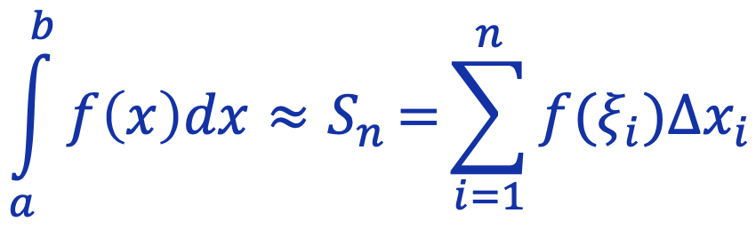
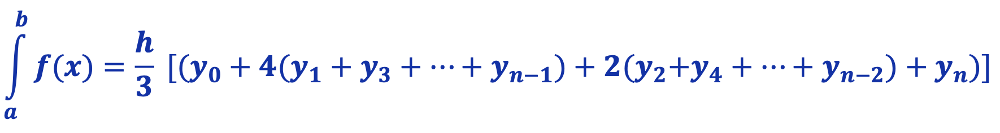
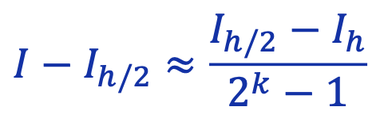
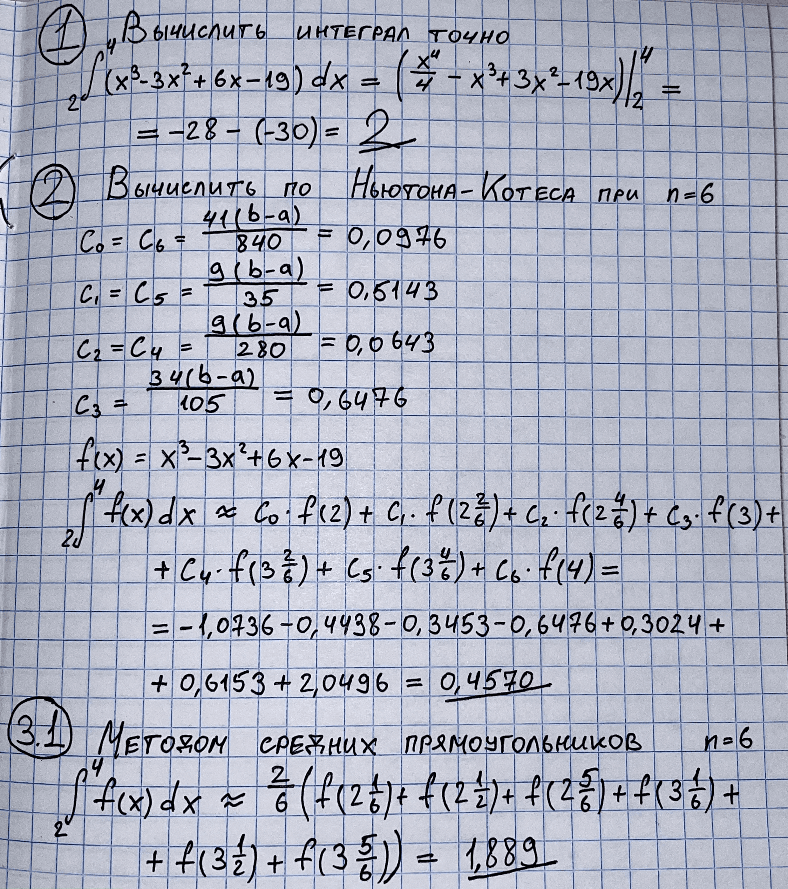
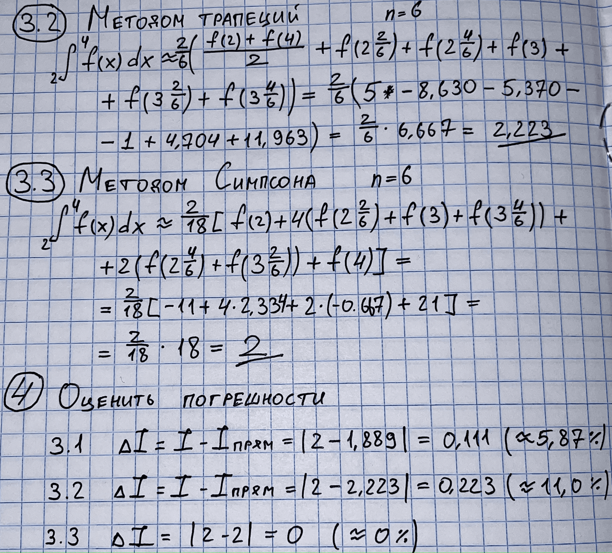

# Лабораторная №3 «Численное интегрирование»
**Вариант №19**

| Выполнил      | Группа | Преподаватель  |
|:--------------|--------|----------------|
| Яковлев Г. А. | P3213  | Малышева Т. А. |

## Цель работы
Найти приближенное значение определенного интеграла с требуемой точностью различными численными методами.

## Порядок выполнения работы
1. Реализовать в программе методы по выбору пользователя, исходя из варианта:
    - **Метод прямоугольников** (3 модификации: левые, правые, средние)
    - **Метод Симпсона**
2. Вычислительная реализация задачи
    - Вычислить интеграл, приведенный в таблице точно
    - Вычислить интеграл по формуле Ньютона – Котеса при *n = 6*
    - Вычислить интеграл по формулам средних прямоугольников, трапеций и Симпсона при *n = 6*
    - Сравнить результаты с точным значением интеграла
    - Определить относительную погрешность вычислений

## Рабочие формулы методов
Метод прямоугольников:



Метод Симпсона:



Правило Рунге:


## Листинг программы
`f.subs(x, число)` — подставляет число в формулу `f(x)` и возвращает результат

Метод прямоугольников:
```python
def rectangle_method(t: RectangleType, f: Symbol, a: float, b: float, n: int,
                     accuracy: float, check_runge: bool) -> float:
    h = (b - a) / n  # длина отрезка
    if a == b:
        return 0
    arr = arange(a, b, h)  # массив отрезков

    if t == RectangleType.LEFT:
        ans = h * sum(f.subs(x, xi) for xi in arr)
    elif t == RectangleType.MIDDLE:
        ans = h * sum(f.subs(x, xi + h / 2) for xi in arr)
    elif t == RectangleType.RIGHT:
        ans = h * sum(f.subs(x, xi + h) for xi in arr)
    else:
        raise RuntimeError("Поведение не определено")

    if check_runge:
        runge_ans = rectangle_method(t, f, a, b, n * 2, accuracy, False)
        if abs(runge_ans - ans) < accuracy:
            return runge_ans
        else:
            return rectangle_method(t, f, a, b, n * 2, accuracy, True)
    return ans
```

Метод Симпсона:
```python
def simpsons_method(f: Symbol, a: float, b: float, n: int, accuracy: float, check_runge: bool) -> float:
    if n % 2 != 0:
        fatal_error("Для метода Симпсона необходимо четное число разбиений.")
    h = (b - a) / n  # длина каждого отрезка
    arr = arange(a, b, h)  # массив отрезков

    y0 = f.subs(x, a)  # y нулевое
    yn = f.subs(x, b)  # y последнее

    odds = sum(f.subs(x, xi) for xi in arr[1:n:2])  # результат функции на нечетных отрезках
    evens = sum(f.subs(x, xi) for xi in arr[2:n:2])  # результат функции на четных отрезках
    
    ans = (h / 3) * (y0 + 4 * odds + 2 * evens + yn)  # формула Симпсона
    
    if check_runge:
        runge_ans = simpsons_method(f, a, b, n * 2, accuracy, False)
        if abs(runge_ans - ans) < accuracy:
            return runge_ans
        else:
            return simpsons_method(f, a, b, n * 2, accuracy, True)
    return ans
```

## Результаты выполнения программы
```java
ykvlv@MacBook lab3 % python3 main.py
1	Метод прямоугольников (левые)
2	Метод прямоугольников (средние)
3	Метод прямоугольников (правые)
4	Метод Симпсона
Выберите метод: 2
1	x³ - 3x² + 6x - 19
2	-4x³ - 3x² + 5x - 20
3	x²
Выберите функцию: 1
Введите левый предел: 2
Введите правый предел: 4
Введите число разбиений: 100
Ответ: 1.99960000000003
```

```java
ykvlv@MacBook lab3 % python3 main.py
1	Метод прямоугольников (левые)
2	Метод прямоугольников (средние)
3	Метод прямоугольников (правые)
4	Метод Симпсона
Выберите метод: 4
1	x³ - 3x² + 6x - 19
2	-4x³ - 3x² + 5x - 20
3	x²
Выберите функцию: 2
Введите левый предел: 0.124
Введите правый предел: 3.352
Введите число разбиений: 14
Ответ: -200.414825859840
```

## Вычисление заданного интеграла



## Выводы
Я познакомился с различными методами решения интегралов. 
Реализовал программу, которая вычисляет интегралы методами Симпсона, прямоугольников.
Научился вычислять погрешность вычисления интеграла.