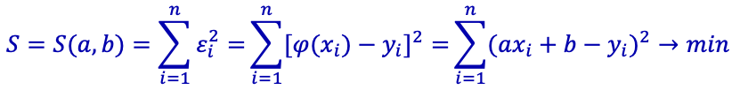
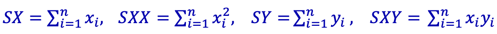
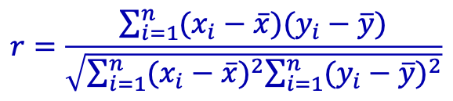
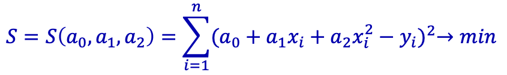
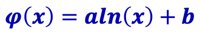
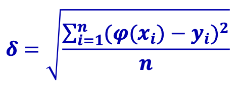
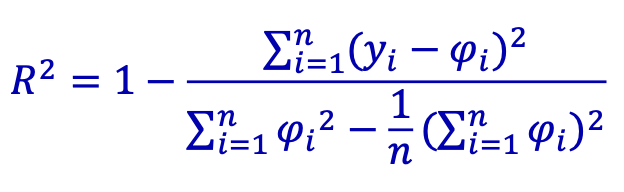
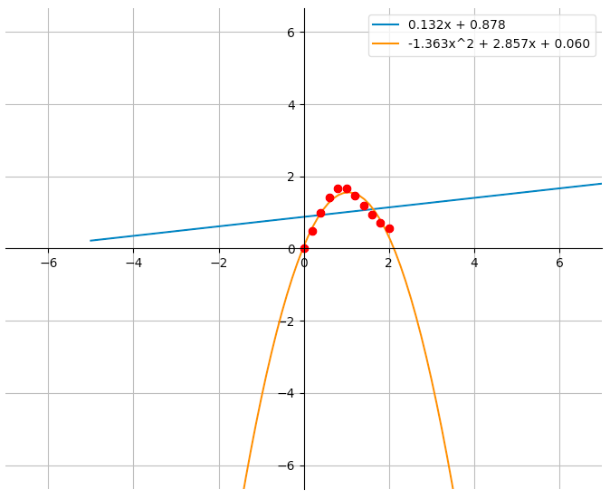

# Лабораторная №4 «Аппроксимация функций»

**Вариант №19**

| Выполнил      | Группа | Преподаватель  |
| :------------ | ------ | -------------- |
| Яковлев Г. А. | P3213  | Малышева Т. А. |

## Цель работы

Найти функцию, являющуюся наилучшим приближением заданной табличной функции по методу наименьших квадратов.

## Порядок выполнения работы
1. Вычислить меру отклонения для всех исследуемых функций.
2. Уточнить значения коэффициентов эмпирических функций, минимизируя функцию S.
3. Сформировать массивы предполагаемых эмпирических зависимостей.
4. Определить среднеквадратичное отклонение для каждой аппроксимирующей функции. Выбрать наименьшее значение и, следовательно, наилучшее приближение.
5. Построить графики полученных эмпирических функций.

## Рабочие формулы методов
Линейная аппроксимация:





Коэффициент корреляции:



Квадратичная аппроксимация:



Аппроксимация других функций:



Среднеквадратическое отклонение:



Достоверность аппроксимации:



## Листинг программы
Линейная аппроксимация:

```python
def linear(xs: list, ys: list, n: int):
    SX = sum(xs)
    SXX = sum(x ** 2 for x in xs)
    SY = sum(ys)
    SXY = sum(xs[i] * ys[i] for i in range(n))

    a, b = np.linalg.solve(
        np.array([[SXX, SX], [SX, n]]),
        np.array([SXY, SY])
    )

    ps = [a * xs[i] + b for i in range(n)]
    S = sum((ps[i] - ys[i]) ** 2 for i in range(n))

    print(f'Коэффициент корреляции: {correlation(xs, ys):.3f}')

    return msr(ps, ys, n), float(S), confidence(ps, ys, n), lambda x: a * x + b, f'{a:.3f}x + {b:.3f}'
```

Квадратичная аппроксимация:

```python
def quadratic(xs: list, ys: list, n: int):
    pf = np.polyfit(xs, ys, 2)
    ps = np.poly1d(pf)(xs)

    S = sum((ps[i] - ys[i]) ** 2 for i in range(n))

    return msr(ps, ys, n), float(S), confidence(ps, ys, n), \
           lambda x: pf[0] * x ** 2 + pf[1] * x + pf[2], \
           f'{pf[0]:.3f}x^2 + {pf[1]:.3f}x + {pf[2]:.3f}'
```

Кубическая аппроксимация:

```python
def cubic(xs: list, ys: list, n: int):
    pf = np.polyfit(xs, ys, 3)
    ps = np.poly1d(pf)(xs)

    S = sum((ps[i] - ys[i]) ** 2 for i in range(n))

    return msr(ps, ys, n), float(S), confidence(ps, ys, n), \
           lambda x: pf[0] * x ** 3 + pf[1] * x ** 2 + pf[2] * x + pf[3], \
           f'{pf[0]:.3f}x^3 + {pf[1]:.3f}x^2 + {pf[2]:.3f}x + {pf[3]:.3f}'
```

Степенная аппроксимация:

```python
def power(xs: list, ys: list, n: int):
    XS = [math.log(xs[i]) for i in range(n)]
    YS = [math.log(ys[i]) for i in range(n)]
    A, B = np.polyfit(XS, YS, 1)[:]
    a, b = math.exp(A), B
    ps = [a * xs[i] ** b for i in range(n)]

    S = sum((ps[i] - ys[i]) ** 2 for i in range(n))

    return msr(ps, ys, n), float(S), confidence(ps, ys, n), \
           lambda x: a * math.pow(x, b), \
           f'{a:.3f}x^{b:.3f}'
```

Экспоненциальная аппроксимация:

```python
def exponential(xs: list, ys: list, n: int):
    YS = [math.log(ys[i]) for i in range(n)]
    A, B = np.polyfit(xs, YS, 1)[:]
    a, b = math.exp(A), B
    ps = [a * math.exp(b * xs[i]) for i in range(n)]

    S = sum((ps[i] - ys[i]) ** 2 for i in range(n))

    return msr(ps, ys, n), float(S), confidence(ps, ys, n), \
           lambda x: a * math.exp(b * x), \
           f'{a:.3f}e^{b:.3f}x'
```

Логарифмическая аппроксимация:

```python
def logarithmic(xs: list, ys: list, n: int):
    XS = [math.log(xs[i]) for i in range(n)]
    A, B = np.polyfit(XS, ys, 1)[:]
    a, b = A, B

    ps = [a * math.log(xs[i]) + b for i in range(n)]

    S = sum((ps[i] - ys[i]) ** 2 for i in range(n))

    return msr(ps, ys, n), float(S), confidence(ps, ys, n), \
           lambda x: a * math.log(x) + b, \
           f'{a:.3f}ln(x) + {b:.3f}'
```

## Результаты выполнения программы

```python
ykvlv@MacBook lab4 % python3 main.py
Путь до входного файла (из консоли — Enter): tests/cubic
Путь до выходного файла (в консоль — Enter): 
1. Линейная функция
phi(x) = 2.547x + -2.248
S = 47.411
δ = 2.603
R^2 = 0.773
Коэффициент корреляции: 1.831
2. Квадратичная функция
phi(x) = 0.602x^2 + -2.687x + 6.365
S = 5.190
δ = 0.861
R^2 = 0.979
3. Кубическая функция
phi(x) = 0.127x^3 + -1.040x^2 + 3.325x + 0.775
S = 0.930
δ = 0.365
R^2 = 0.996
4. Экспоненциальная функция
phi(x) = 1.323e^0.765x
S = 210271.165
δ = 173.317
R^2 = -0.473
5. Логарифмическая функция
phi(x) = 7.455ln(x) + -0.825
S = 103.499
δ = 3.845
R^2 = 0.321
6. Степенная функция
phi(x) = 2.383x^0.855
S = 80.160
δ = 3.384
R^2 = 0.106

Лучше всего аппроксимирует Кубическая функция: δ = 0.365
```

## Вычислительная реализация задачи

Для заданной функции построить наилучшие линейное и квадратичное приближения по 11 точкам указанного интервала:

$$
y = \frac{5x}{x^4+2},\ x\in[0;2] \ h=0.2
$$

Полученные точки:

| X    | 0.0  | 0.2  | 0.4  | 0.6  | 0.8  | 1.0  | 1.2  | 1.4  | 1.6  | 1.8  | 2.0  |
| :--- | ---- | ---- | ---- | ---- | ---- | ---- | ---- | ---- | ---- | ---- | ---- |
| Y    | 0.00 | 0.50 | 0.99 | 1.41 | 1.66 | 1.67 | 1.47 | 1.20 | 0.94 | 0.72 | 0.56 |

### Линейная аппроксимация

Вычисляем суммы: **SX** = 11.0; **SXX** = 15.40; **SY** = 11.105; **SXY** = 11.684

Получаем систему линейных уравнений:

$$
\begin{cases}
    15.4a+11b=11.684\\
    11a+11b=11.105
\end{cases}
$$

Определители: **d** = 48.40, **d1** = 6.371, **d2** = 42.489

Решая систему, получаем значения коэффициентов:

**a** = 6.371 / 48.40 = 0.132; **b** = 42.489 / 48.40 = 0.878

Получим линейную модель: **P(x)** = 0.132x + 0.878

Мера отклонения: **S** = 2.763

Среднеквадратическое отклонение: **δ** = 0.501

### Квадратичная аппроксимация

Вычисляем суммы: **SX** = 11.0, **SXX** = 15.40, **SXXX** = 24.20, **SXXXX** = 40.534, **SY** = 11.105, **SXY** = 11.684, **SXXY** = 14.834

Получаем систему линейных уравнений:

$$
\begin{cases}
    11a_0+11a_1+15.4a_2=11.105\\
    11a_0+15.4a_1+24.2a_2=11.684\\
    15.4a_0+24.2a_1+40.534a_2=14.834
\end{cases}
$$

Решая систему, получаем значения коэффициентов:

**a0** = 0.060; **a1** = 2.857; **a2** = -1.363

Получим квадратичную модель: **P(x)** = -1.363x<sup>2</sup> + 2.857x + 0.060

Мера отклонения: **S** = 0.214

Среднеквадратическое отклонение: **δ** = 0.139

### Графики линейного и квадратичного приближений



## Выводы

Я научился находить различные аппроксимации по методу наименьших квадратов. Была написана программа способная вычислять наилучшую аппроксимирующую функцию.
