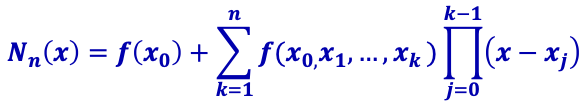
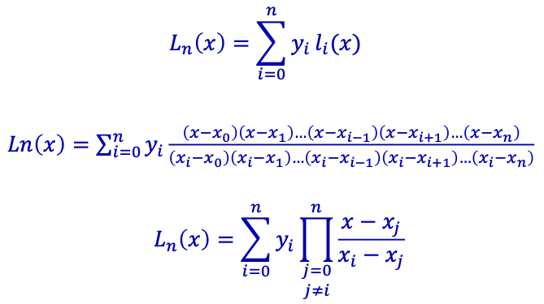
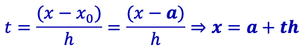
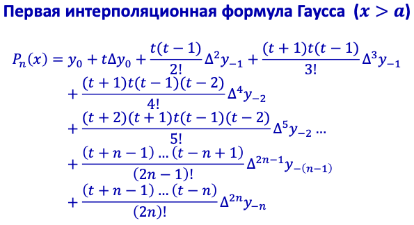
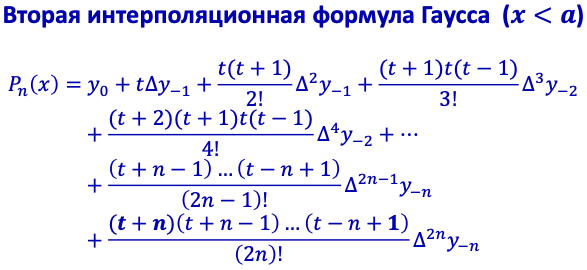
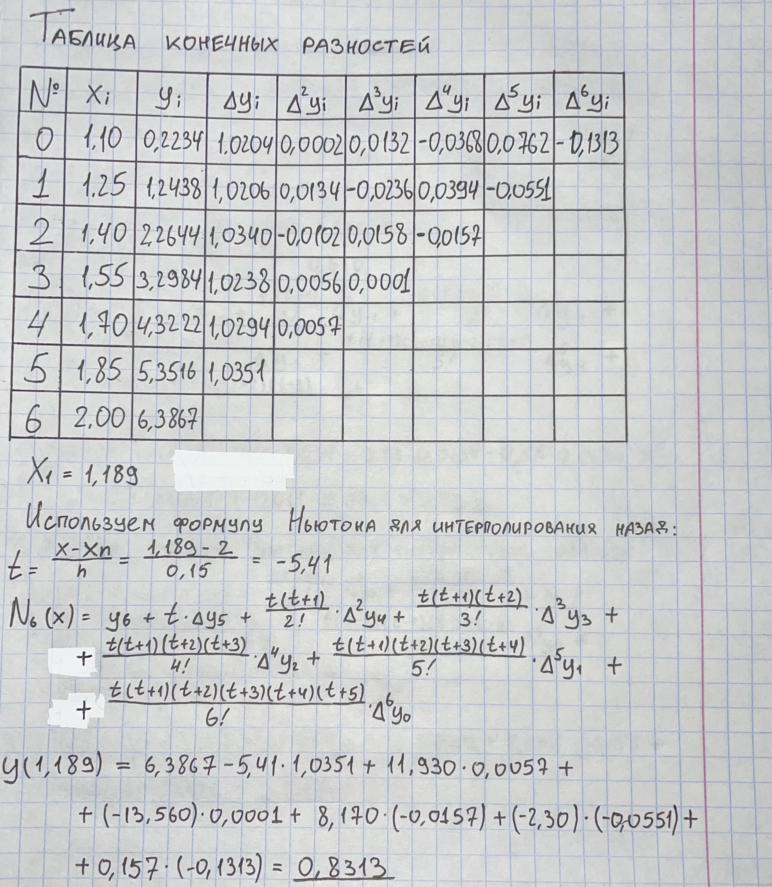
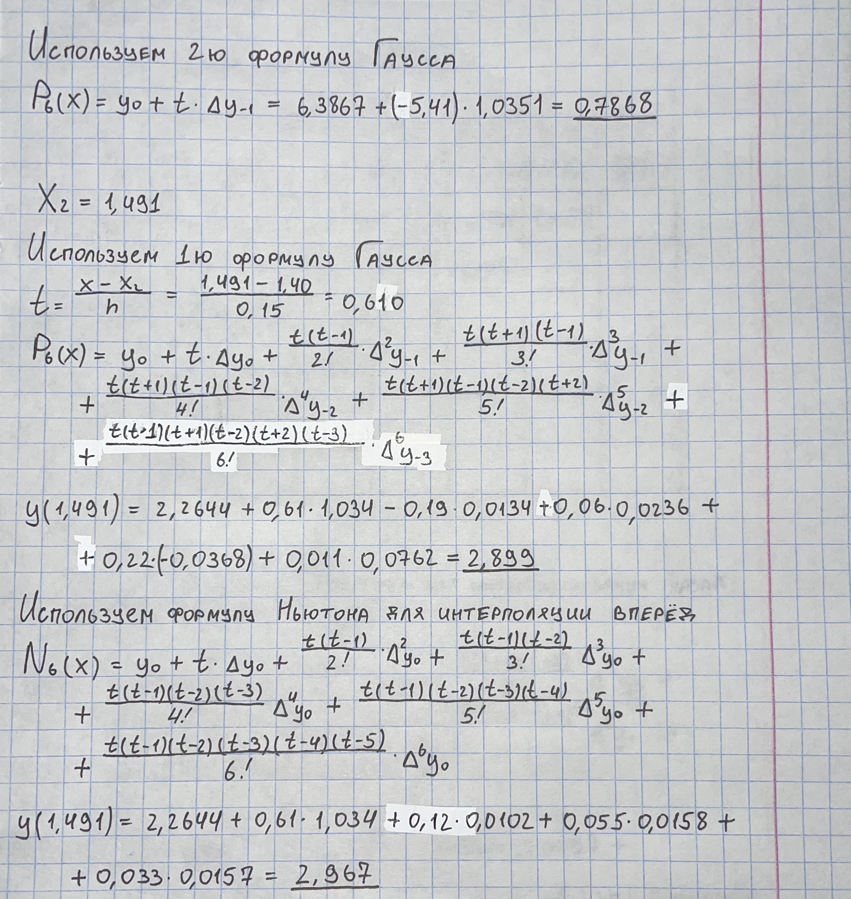
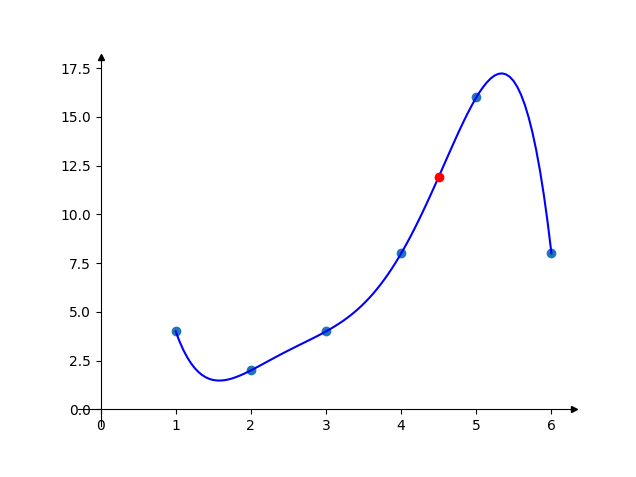

# Лабораторная №5 «Интерполяция функции»

**Вариант №19**

| Выполнил      | Группа | Преподаватель  |
| :------------ | ------ | -------------- |
| Яковлев Г. А. | P3213  | Малышева Т. А. |

## Цель работы

Решить задачу интерполяции, найти значения функции при заданных значениях аргумента, отличных от узловых точек. Для исследования использовать: 

- многочлен Лагранжа
- многочлен Ньютона
- многочлен Гаусса

## Порядок выполнения работы

1. Выполнить вычислительную реализацию задачи
2. В прогрманной реализации задачи:
   1. Исходные данные задаются в виде: таблицы x,y; на основе выбранной функции 
   2. Вычислить приближенное значение функции для заданного значения аргумента, введенного с клавиатуры
   3. Построить графики заданной функции с отмеченными узлами интерполяции и интерполяционного многочлена Ньютона/Гаусса (разными цветами).

## Рабочие формулы методов

Многочлен Ньютона:



Многочлен Лагранжа:



Многочлен Гаусса:







## Вычислительная реализация задачи

Задание:

| x    | y      | № варианта | X<sub>1</sub> | X<sub>2</sub> |
| ---- | ------ | ---------- | ------------- | ------------- |
| 1.10 | 0.2234 | 3          | 1.121         | 1.482         |
| 1.25 | 1.2438 | 7          | 1.852         | 1.652         |
| 1.40 | 2.2644 | 11         | 1.168         | 1.463         |
| 1.55 | 3.2984 | 15         | 1.875         | 1.575         |
| 1.70 | 4.3222 | **19**     | **1.189**     | **1.491**     |
| 1.85 | 5.3516 | 23         | 1.891         | 1.671         |
| 2.00 | 6.3867 | 27         | 1.217         | 1.473         |

Решение:





## Листинг программы

Многочлен Лагранжа:

```python
def lagrange(dots, x):
    result = 0

    n = len(dots)
    for i in range(n):
        nom, denom = 1, 1
        for j in range(n):
            if i == j:
                continue
            nom *= x - dots[j][0]
            denom *= dots[i][0] - dots[j][0]
        result += dots[i][1] * nom / denom

    return result
```

Многочлен Гаусса:

```python
def gauss(dots, x):
    n = len(dots)
    y = [[0 for _ in range(n)] for _ in range(n)]
    for k in range(n):
        y[k][0] = dots[k][1]

    for i in range(1, n):
        for j in range(n - 1):
            y[j][i] = y[j + 1][i - 1] - y[j][i - 1]

    result = y[n // 2][0]
    t = (x - dots[n // 2][0]) / (dots[1][0] - dots[0][0])
    for i in range(1, n):
        for j in range(1, i):
            t *= t + ((-1) ** j) * ((j + 1) // 2)
        result += t * y[(n - i) // 2][i] / factorial(i)

    return result
```

## Результаты выполнения программы

```python
ykvlv@MacBook lab5 % python3 main.py
Выберите метод интерполяции.
1. Многочлен Лагранжа
2. Многочлен Гаусса
Метод решения: 1
Выберите способ ввода исходных данных.
1. Набор точек
2. Функция
Способ: 1
Введите координаты через пробел. Enter — конец ввода.
1 4
2 2
3 4
4 8
5 16
6 8

Значение аргумента для интерполирования: 4.5
Приближенное значение функции: 11.9296875
```



## Выводы

Я узнал что такое интерполяция функции. Применил на практике методы Ньютона, Лагранжа, Гаусса. Была реализована программа, вычисляющая точку интерполяции по заданным аргументам.
