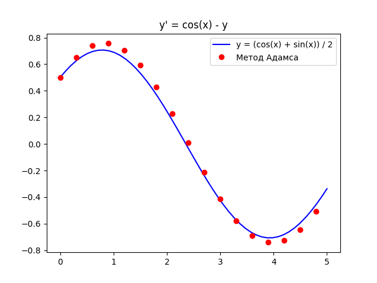

# Лабораторная №6 «Численное дифференцирование»

**Вариант №19**

| Выполнил      | Группа | Преподаватель  |
| :------------ | ------ | -------------- |
| Яковлев Г. А. | P3213  | Малышева Т. А. |

## Цель работы

Решить задачу Коши численными методами. Для исследования использовать: 

- Одношаговые методы
- Многошаговые методы

## Порядок выполнения работы

1. По исходным данным: ОДУ, y<sub>0</sub>, интервал, шаг, точность — реализовать численное дифференцирование.
2. Составить таблицу приближенных значений интеграла дифференциального уравнения, удовлетворяющего начальным условиям.
3. Для оценки точности использовать правило Рунге. Сформировать массивы предполагаемых эмпирических зависимостей.
4. Построить графики точного решения и полученного численного решения (разными цветами).

## Рабочие формулы методов
Метод Эйлера:

$$
y_{i+1}=y_i+hf(x_i,y_i)
$$

Метод Адамса:

$$
y_{i+1}=y_i+hf_i+\frac{h^2}{2}\Delta f_i+\frac{5h^3}{12}\Delta^2f_i+\frac{3h^4}{8}\Delta^3f_i
$$

## Листинг программы
Метод Эйлера:

```python
def euler_method(func, h, a, b, y0):
    x, y = [a], [y0]
    x0 = a + h
    while abs(x0 - b) > 1e-9:
        x.append(x0)
        y.append(y[-1] + h * func(x0, y[-1]))
        x0 += h

    return x, y
```

Метод Адамса:

```python
def adams_method(func, h, a, b, y0):
    n = int((b - a) / h)
    x, y = [a], [y0]
    for i in range(n):
        x.append(x[i] + h)
        y.append(y[i] + h * func(x[i], y[i]))

    for i in range(3, len(x)):
        k = [func(x[i - q], y[i - q]) for q in range(4)]
        df = k[0] - k[1]
        d2f = k[0] - 2 * k[1] + k[2]
        d3f = k[0] - 3 * k[1] + 3 * k[2] - k[3]
        y[i] = (
            y[i - 1] +
            1 * h ** 1 * k[1] +
            1 * h ** 2 * df / 2 +
            5 * h ** 3 * d2f / 12 +
            3 * h ** 4 * d3f / 8
        )

    return x, y
```

## Результаты выполнения программы

```python
ykvlv@MacBook lab6 % python3 main.py
1.	y' = y + (1 + x) * y ** 2
	x[1; 1.5], y(1) = -1
2.	y' = cos(x) - y
	x[0; 5], y(0) = 0.5
Выберите дифференциальное уравнение: 2
1. Метод Эйлера
2. Метод Адамса
Выберите метод решения: 2
Выберите шаг (h): 0.3
 i      x        y      f(x, y)   Точное решение    eps   
 0   0.00000  0.50000   0.50000      0.50000      0.00000 
 1   0.30000  0.65000   0.30534      0.62543      0.02457 
 2   0.60000  0.74160   0.08373      0.69499      0.04661 
 3   0.90000  0.75640   -0.13479     0.70247      0.05393 
 4   1.20000  0.70568   -0.34332     0.64720      0.05848 
 5   1.50000  0.59372   -0.52298     0.53412      0.05960 
 6   1.80000  0.43006   -0.65726     0.37332      0.05674 
 7   2.10000  0.22900   -0.73384     0.17918      0.04981 
 8   2.40000  0.00824   -0.74563     -0.03097     0.03920 
 9   2.70000  -0.21268  -0.69139     -0.23835     0.02567 
 10  3.00000  -0.41416  -0.57583     -0.42444     0.01028 
 11  3.30000  -0.57831  -0.40917     -0.57261     0.00570 
 12  3.60000  -0.69055  -0.20620     -0.66964     0.02091 
 13  3.90000  -0.74092  0.01499      -0.70685     0.03407 
 14  4.20000  -0.72496  0.23470      -0.68092     0.04404 
 15  4.50000  -0.64414  0.43334      -0.59416     0.04997 
 16  4.80000  -0.50569  0.59319      -0.45433     0.05136 
Погрешность: 0.05960327378752506
По Рунге: 0.005224945170371353
```



## Выводы

Я научился решать обыкновенные дифференциальные уравнения одношаговыми, многошаговыми методами. Познакомился с методами решения ОДУ: Эйлера, Рунге-Кутта, Адамса, Милна. Была реализована программа, способная проводить вычисления за меня.
